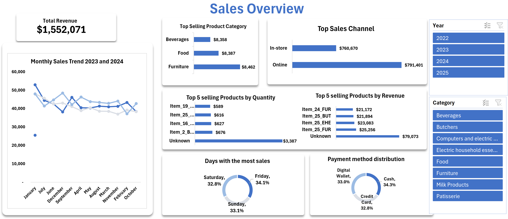

# 🛒 Retail Store Sales Analysis Dashboard

This project presents a comprehensive analysis of retail store sales using **Microsoft Excel**. It includes data cleaning, exploratory analysis, pivot table summaries, and a dynamic dashboard to visualize business performance and gain key insights.

---

## 📊 Dashboard Snapshot

---

## 📌 Project Objective

To analyze sales data across various product categories, channels, and timelines to answer critical business questions:

1. What is the total revenue generated?
2. Which product category has the highest sales?
3. Which branch contributes the most revenue?
4. How do monthly sales trend over time?
5. What are the top-selling products by quantity and revenue?
6. Which day has the highest sales?
7. What payment methods are most commonly used?

---

## 🛠️ Tools & Techniques Used

- **Microsoft Excel**
  - Data Cleaning
  - Pivot Tables
  - Conditional Formatting
  - Dashboard Creation
  - Data Validation
- **Data Visualization**
  - Column & Bar Charts
  - Line Graphs
  - Donut Charts

---

## 📈 Key Insights

- **Total Revenue:** $1,552,071
- **Top-Selling Category:** Furniture (8,462 items)
- **Top Sales Channel:** Online ($791,401)
- **Peak Sales Days:** Friday, Saturday, and Sunday (over 32% each)
- **Top Products by Revenue:** Unknown ($79,073), Item_25_FUR ($25,256), and more
- **Payment Methods:** Cash (34.3%) > Digital Wallet > Credit Card

---

## 📌 Business Recommendations

- Focus on top-performing categories (e.g., Furniture).
- Enhance online sales strategies and user experience.
- Plan campaigns around weekends and peak months.
- Clean and track "Unknown" product categories more efficiently.
- Promote digital payments with rewards or cashback.

---

## 📁 Project Deliverables

- ✅ Cleaned Excel Dataset
- ✅ Pivot Table Summaries
- ✅ Excel Dashboard
- ✅ Project Report (Word / PDF)
- ✅ README Documentation

---

## 📄 Report Access

- [📥 Download the Full Report](Retail_Store_Sales_Report.pdf)
- [🖼 Dashboard Screenshot](Dashboard_Screenshort.png)

---

## 📌 Author

**AKINWANDE Nurat**   
Data Analyst & Excel Enthusiast  
🇳🇬 Nigeria

---

> This project demonstrates how powerful insights can be derived from Excel alone—no fancy tools needed to start making a business impact!
